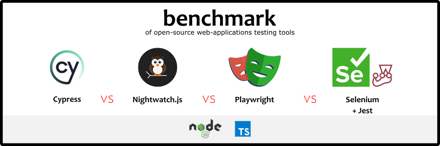

# Benchmark of web-applications testing tools



Here we compare [ Cypress.io](https://cypress.io/) *vs* [Nightwatch.js](https://nightwatchjs.org) *vs* [Playwright](https://playwright.dev/) *vs* [Selenium WebDriver](https://www.selenium.dev/documentation/webdriver/), all in their [Node.js](https://nodejs.org) versions first.

We present in this repo some concrete examples of automated tests implemented in differents tools.

## Constraints

- all implemented tests will use the **Chrome browser already installed** [^1] on the machine
- Browser is in **headless** mode [^2]
- all tests written in **TypeScript**.

## What will be studied and compared?

- Installation
- Readability of tests
- Execution time:
  - overall execution time
  - execution time by test scenario run
- more?

## List of tests scenarios

See this page: ["List of tests scenarios"](tests/README.md)

## Install

Execute in your terminal this command: `npm init`

## Run tests

### All at once

Execute in your terminal this command: `npm test`

Run the test set 5 times?

```shell
for ((n=0;n<5;n++)); do npm test; done
```

### For a specific framework


- for Cypress: `npm test:cy`
- for Playwright: `npm test:pw`
- for Selenium+Jest: `npm test:se`
- for Nightwatch: `npm test:nw`

> to be completed!

## Is this an article?

No.

There is many articles that compare those frameworks, presenting their features, trade-offs, etc.

Like: 
- ["Which web testing tool should i use?
"](https://automationpanda.com/2023/04/24/which-web-testing-tool-should-i-use)
 
  > (in english, 24/04/2023, by Andrew Knight aka [@automationpanda](https://twitter.com/automationpanda))

- ["Choix du logiciel et avis - Framework : Selenium vs Playwright vs Cypress"](https://blog.mrsuricate.com/choix-logiciel-avis-framework-selenium-playwright-cypress)
 
  > (in french, 13/03/2023, by [*Mr Suricate*](https://www.mrsuricate.com/))


---

Notes: 

[^1]: forced via `--browser` argument CLI command for Cypress.io, in configuration for Nightwatch and Playwright, and inside tests code for Selenium

[^2]: forced for Selenium, default mode for other

