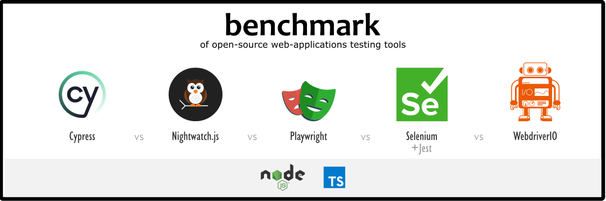

# Benchmark of web-applications testing tools



Here we compare [Cypress.io](https://cypress.io/) *vs* [Nightwatch.js](https://nightwatchjs.org) *vs* [Playwright](https://playwright.dev/) *vs* [Selenium WebDriver](https://www.selenium.dev/documentation/webdriver/) *vs* [WebdriverIO](https://github.com/webdriverio/webdriverio), all in their [Node.js](https://nodejs.org) versions.

We present in this repo some concrete examples of automated tests implemented in differents tools.

## Constraints

- all implemented tests will use the **Chrome browser already installed** [^1] on the machine
- Browser is in **headless** mode [^2]
- all tests written in **TypeScript**.

## List of tests scenarios

See this page: ["List of tests scenarios"](tests/README.md)

## Install

Execute in your terminal this command: `npm init`

## Run tests

### All at once, with all frameworks

Execute in your terminal this command: `npm test`

Run the test set 5 times?

```shell
for ((n=0;n<5;n++)); do npm test; done
```

### Run all tests with a specific framework


| tool          | command       | detailed script                                                         |
| ------------- | ------------- | ----------------------------------------------------------------------- |
| Cypress       | `npm test:cy` | [tests/with-cypressio/run.sh](./tests/with-cypressio/run.sh)            |
| Nightwatch    | `npm test:nw` | [tests/with-nightwatch/run.sh](./tests/with-nightwatch/run.sh)          |
| Playwright    | `npm test:pw` | [tests/with-playwright/run.sh](./tests/with-cypressplaywrightio/run.sh) |
| Selenium+Jest | `npm test:se` | [tests/with-selenium-jest/run.sh](./tests/with-selenium-jest/run.sh)    |
| WebdriverIO   | `npm test:wi` | [tests/with-webdriverio/run.sh](./tests/with-webdriverio/run.sh)        |

## Is this an article?

No. But the code present in this repository (and its execution) will be used in this article: [Benchmark of web-applications testing tools](https://articles.testndev.com/testing/300-web-app-testing-tools-benchmark.html).

---

Notes: 

[^1]: forced via `--browser` argument CLI command for Cypress.io, in configuration for Nightwatch and Playwright, and inside tests code for Selenium

[^2]: forced for Selenium, default mode for other

